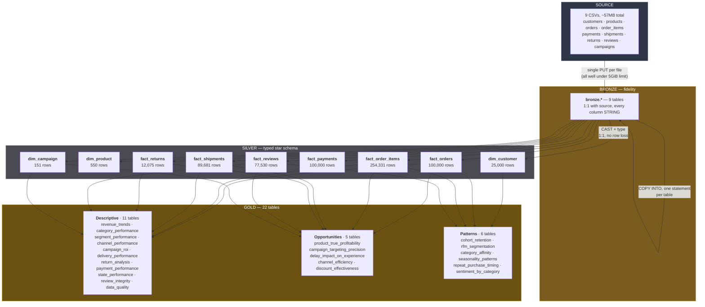
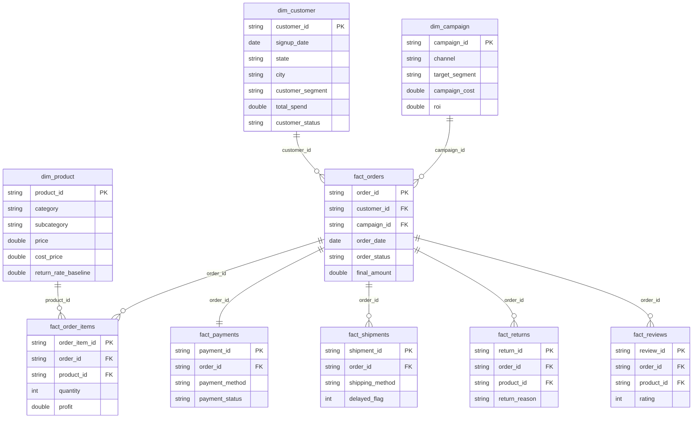

# Indian E-Commerce Analytics on Databricks

> ### In short
>
> **The data**: a synthetic but internally-consistent Indian e-commerce
> dataset — 100K orders, 25K customers, 3 years, 15 states.
>
> **What it found**: Same-Day delivery fails **54–60% of the time**, at every
> single warehouse — it isn't a regional problem, the service tier itself is
> broken as a promise. Electronics drives $1.22B in revenue at a **0.69%
> margin**, while Fashion drives 9x less revenue at **33% margin** — a margin
> mix problem hiding behind a top-line number. And customer segment predicts
> *spend* well but predicts *churn* barely at all (52–55% churn across every
> segment except New).

---

A Databricks lakehouse built on Unity Catalog and Delta Lake: a full
bronze/silver/gold medallion pipeline, a Lakeview dashboard, an AI/BI Genie
space for natural-language questions, and a documented set of business
findings — built to answer real e-commerce operating questions (delivery
reliability, category margin, customer retention, campaign effectiveness)
rather than just to demonstrate the platform.

## The dataset

[Indian E-Commerce Sales and Customer Analytics](https://www.kaggle.com/datasets/shiyalkishan01/indian-e-commerce-sales-and-customer-analytics)
(Kaggle, CC0). **100% synthetic** — generated by a single reproducible,
seeded script (`generate_dataset.py`, included in the source), not derived
from any real company's data or any real individual. City/state names
reference real Indian geography for realism; no real customer or business is
represented.

Nine tables, already relationally consistent (single generator, consistent
foreign keys across customers/orders/order_items/payments/shipments/returns/
reviews/campaigns) — every foreign key resolves cleanly, which is confirmed
directly in [Data quality](#data-quality) below rather than assumed.

| Table | Rows | Grain |
|---|---|---|
| `customers` | 25,000 | one customer |
| `products` | 550 | one product |
| `orders` | 100,000 | one order |
| `order_items` | 254,331 | one line item |
| `payments` | 100,000 | one order's payment |
| `shipments` | 89,681 | one shipped order |
| `returns` | 12,075 | one returned item |
| `customer_reviews` | 77,530 | one review |
| `marketing_campaigns` | 151 | one campaign |

## Architecture

A medallion pipeline adapted to a relational source: bronze mirrors the 9
CSVs 1:1 (all `STRING`), silver types and conforms them into a proper star
schema (3 dimensions, 6 fact tables), gold holds 22 business-facing tables
(11 descriptive + 5 opportunity/diagnostic + 6 pattern-analysis).

Every source file here is well under the Files API's 5GiB single-PUT limit
(largest is `order_items.csv` at 17MB), so ingestion is a single `PUT` per
file, direct to a Unity Catalog Volume, then one straightforward `COPY INTO`
per table — no multi-part streaming required.



**Every row survives bronze → silver unchanged** — 100,000 orders in, 100,000
`fact_orders` out, same for every other table. No deduplication step is
needed because the source is a single-generator dataset with enforced
consistency — see [Data quality](#data-quality) for what that means and
doesn't mean.

### Star schema



`fact_orders` is the hub every other fact table hangs off — this is why the
opportunity tables (delay-vs-rating, targeting precision) all start from an
order-level join rather than joining shipments/reviews/campaigns to each other
directly.

## Data quality

Referential integrity between orders/payments/shipments, and a sanity check
on zero-value orders:

| Check | Affected | % |
|---|---|---|
| Orders with no matching payment | 0 | 0.00% |
| Delivered orders with no shipment record | 0 | 0.00% |
| Failed orders with a successful payment | 0 | 0.00% |
| Orders with `final_amount = 0` | 0 | 0.00% |

**All four checks came back clean.** That's the expected result for a
single-generator synthetic dataset with enforced FK consistency — worth
verifying explicitly rather than assuming, because "the schema looks
structured" is not the same claim as "the data is internally consistent."
Every finding below rests on that verification, not on an assumption about
synthetic data being inherently clean.

## Findings

Full numbers in the tables below; here's what to act on.

### 1. Same-Day delivery is broken as a promise, everywhere

`gold.delivery_performance` — delay rate by warehouse × shipping method:

| Warehouse | Method | Shipments | Delay rate |
|---|---|---|---|
| Ahmedabad | Same-Day | 632 | **60.1%** |
| Mumbai | Same-Day | 902 | **56.7%** |
| Delhi-NCR (Gurugram) | Same-Day | 1,125 | **56.6%** |
| Chennai | Same-Day | 574 | **56.1%** |
| Bengaluru | Same-Day | 363 | **54.6%** |

This is every major warehouse, all clustering in the same 54–60% band. That
consistency is the finding: it rules out a single bad warehouse or a regional
logistics partner, and points at the Same-Day *promise itself* being
structurally unrealistic — a commitment the fulfillment network isn't built
to keep, not an execution problem in one city.

**What to do**: either invest in the Same-Day fulfillment capacity to make
the promise real, or stop selling it as a checkout option and set expectations
that don't get broken most of the time.

### 2. Revenue and margin point in opposite directions

`gold.category_performance`:

| Category | Revenue | Margin |
|---|---|---|
| Electronics | $1.22B | **0.69%** |
| Appliances | $405M | 3.89% |
| Home & Kitchen | $158M | 17.96% |
| Fashion | $139M | **33.14%** |
| Footwear | $83M | 29.42% |

Electronics is 8.8x Fashion's revenue and earns roughly **1/48th** the margin
rate. A pure revenue-by-category view (the metric most dashboards default to)
would rank Electronics as the star category and miss that it is running at
break-even-or-worse while Fashion, Footwear, and Bags are the categories
actually generating profit per rupee sold.

**What to do**: report margin alongside revenue everywhere Electronics
appears. A growth strategy built on Electronics volume is a strategy for
growing revenue while barely growing profit.

### 3. Customer segment predicts spend, not survival

`gold.segment_performance`:

| Segment | Avg lifetime spend | Churn rate |
|---|---|---|
| Premium | ₹286,623 | 52.5% |
| Regular | ₹110,862 | 55.5% |
| Budget | ₹45,355 | 54.9% |
| New | ₹22,452 | 44.0% |

Spend spreads across a **12.8x range** by segment — exactly what the segment
label is supposed to predict. Churn barely moves: three of the four segments
sit within 3 points of each other (52–55%), and only "New" (customers who
haven't had time to churn yet, by definition of the label) looks different.

**What to do**: the segment field is doing real work for spend-based
targeting and no work at all for retention modeling. Don't use it as a churn
predictor — build a separate model (recency, order cadence, delivery
experience, return history) if churn is the thing to act on.

### 4. Cash on Delivery has zero payment failures — every prepaid method has some

`gold.payment_performance`:

| Method | Failure rate |
|---|---|
| Cash on Delivery | **0.00%** |
| Net Banking | 5.86% |
| Credit Card | 5.92% |
| UPI | 6.15% |
| EMI | 6.35% |
| Cardless EMI | 7.77% |

COD cannot "fail" in the same sense a digital payment can — there's nothing to
decline until the courier is at the door — so 0% here is structural, not a
quality signal to copy elsewhere. The useful reading is the *prepaid* ranking:
Cardless EMI fails most (7.8%) and also carries the highest per-transaction fee
(₹328.76), a double cost. If checkout friction on Cardless EMI is fixable,
it's the highest-value payment method to fix.

### 5. Fashion accounts for the majority of return volume and reasons span the whole funnel

`gold.return_analysis` — top reasons, Fashion category:

| Reason | Returns | Refunded |
|---|---|---|
| Size issue | 570 | ₹1.51M |
| Product damaged | 522 | ₹1.49M |
| Changed mind | 509 | ₹1.39M |
| Quality issue | 439 | ₹1.16M |
| Product not as expected | 398 | ₹1.03M |

No single reason dominates — sizing, damage-in-transit, buyer's remorse, and
quality are all present at similar volume. That spread means there's no one
fix: a sizing guide addresses "Size issue" only, better packaging addresses
"Product damaged" only. Fashion's low margin (see finding #2) makes this a
double problem — the category with the thinnest revenue is also absorbing
concentrated return costs.

## Opportunities — cross-cutting findings that answer "what do we do"

The gold tables above answer "what happened." Five more, added in
[`sql/04_opportunities.sql`](sql/04_opportunities.sql), cross-cut them to
answer "what's broken and what's it worth."

### Products that look profitable but are net losses after returns

`gold.product_true_profitability` nets refunds against gross profit, per
product. Several products clear ₹80K–₹980K in recorded profit while refunds
run **250–2,250% of that profit** — a "Basic Large Appliance" shows ₹980,618
profit against ₹4,975,142 refunded. A standard product P&L (`order_items`
alone) never nets against returns, so these read as winners until you ask
the second question.

**What to do**: report `net_profit_after_refunds`, not `gross_profit`, in any
product ranking. Any product with `refund_pct_of_profit > 100` needs a
root-cause look (quality, sizing, description accuracy) before further
marketing spend.

### Campaign targeting barely reaches its target segment

`gold.campaign_targeting_precision`: campaigns aimed at "New" customers reach
New customers **3.98%** of the time. Even the best case — Regular-targeted
campaigns reaching Regular customers — is **52.32%**, barely better than
chance across four segments.

**What to do**: audit the targeting mechanism itself (audience list build,
segment sync timing) before spending more on segment-specific creative — the
creative isn't the problem if it never reaches the intended audience.

### Delivery delay hurts satisfaction, not the return rate

`gold.delay_impact_on_experience`: a delayed shipment drops average review
rating from **3.90 to 3.34** — a real, meaningful gap — but return rate is
almost unchanged (**10.08% vs 10.45%**). These are different costs: delay
does not create direct refund exposure, it creates a reputation and
repeat-purchase risk that a return-rate KPI alone would completely miss.

**What to do**: track review rating and repeat-purchase rate as delivery KPIs
alongside return rate, not as an afterthought. A dashboard that only watches
returns will miss this entirely.

### Marketing channels return wildly different value per rupee spent

`gold.channel_efficiency`: Direct/App returns **₹6.20** in attributed revenue
per ₹1 of campaign cost. Facebook returns **₹1.08** — barely break-even. A
**5.7x efficiency gap** inside one marketing budget.

**What to do**: this is a budget-reallocation question, not a creative
question. Before optimizing Facebook campaigns, ask whether that spend is
better moved to Direct/App and Organic Search, which are already outperforming
by 5x+.

### Heavier discounts don't reduce cancellations — they just cost more

`gold.discount_effectiveness`: cancellation rate is flat at **~8%** across
every discount band, while average order value falls from ₹29,033 (no
discount) to ₹21,951 (20%+ discount). If discounting were preventing
cancellations, the cancel rate would fall as discount rises — it doesn't.

**What to do**: don't expand discount depth as a cancellation-prevention
lever without a controlled test. A holdout test — same product, matched
period, discount withheld from a random slice — is the only way to get a
causal answer, and it's cheap relative to the margin at stake.

## Pattern analysis — cohorts, RFM, affinity, seasonality

No free-text review column exists in the source data — only a pre-labeled
`review_sentiment` category and a numeric `rating`. So this is **not** NLP
text-mining; it goes deeper on the structured behavioral data instead. Six
more tables, added in [`sql/06_patterns.sql`](sql/06_patterns.sql):

### Retention decays fast, and unevenly by cohort

`gold.cohort_retention`: a signup cohort's month-1 reorder rate runs
**~29%**, dropping to **~24%** by month 3. That's a real decay curve, not the
single flat churn-rate number in `segment_performance` — useful for judging
whether a lifecycle campaign is working (retention should flatten, not keep
dropping) rather than only watching total churn.

### RFM independently confirms the segment-vs-churn finding

`gold.rfm_segmentation` computes Recency/Frequency/Monetary scores from raw
order data — completely independent of the `customer_segment` label already
on the customer record — then checks whether they agree. Frequency and
monetary scores **do** sort cleanly by segment (Premium highest, New lowest).
Recency scores are **nearly flat** across all four segments (2.29–2.69 of 4).
Two independent methods (this and the churn-rate finding in [Findings §3](#3-customer-segment-predicts-spend-not-survival))
reach the same conclusion from different data: segment predicts what
customers spend, not whether they're still active.

### Fashion is the connective category across the whole catalog

`gold.category_affinity`: ranking every pair of categories bought in the same
order, **Fashion appears in nearly every top pair** — Electronics+Fashion,
Fashion+Home & Kitchen, Fashion+Health & Wellness, Fashion+Grocery,
Appliances+Fashion. It isn't just a category with its own revenue line (see
[Findings §2](#2-revenue-and-margin-point-in-opposite-directions)) — it's the
natural anchor for cross-category bundling, regardless of what else is in the
cart.

### Orders nearly triple from January to December — a ramp, not a spike

`gold.seasonality_patterns`: January is the lowest month (5,169 orders),
December the highest (14,909) — **2.9x**. The steepest single jump is
Sep→Oct (**+40%**), consistent with the festival season (Navratri/Dussehra/
Diwali fall in that window per the source dataset's own generation
methodology) building into year-end. A flat monthly average from
`revenue_trends` alone would badly under-provision Q4 inventory and delivery
capacity.

### The median time to a second order is 34 days — use that, not the mean

`gold.repeat_purchase_timing`: **73%** of all customers (18,254 of 25,000)
eventually place a second order. Median time to that second order is
**34 days**; the mean is **74 days**, pulled up by a long tail of slow
repeaters. A "come back" lifecycle email scheduled off the mean would fire
more than a month late for the typical repeat customer — the median is the
number to design around.

### Sentiment by category — where fit and quality expectations break down

`gold.sentiment_by_category`, using the structured rating/sentiment fields:
**Musical Instruments** (15.8% negative) and **Furniture** (13.3% negative)
lead the negative-review share — categories where sizing, quality
expectations, or damage-in-transit are hardest to get right without seeing
the item first.

## Platform features

- **AI/BI Genie** ([`scripts/create_genie_space.py`](scripts/create_genie_space.py)) —
  22 gold tables, 7 instruction blocks covering the nuanced findings
  above (e.g. "delay hurts rating, NOT return rate — never say delay causes
  more returns"). Verified: asked *"Does a delayed delivery cause more
  returns?"*, Genie correctly separated the satisfaction effect from the
  return-rate non-effect, unprompted.
- **Scheduled job** ([`scripts/create_job.py`](scripts/create_job.py)) —
  5-task pipeline (bronze → silver → gold/opportunities/security), created
  **paused**.
- **3 SQL alerts** ([`scripts/create_alerts.py`](scripts/create_alerts.py)) —
  gold freshness (>36h), Same-Day delay regression (>65%, baseline ~54-60%),
  and a referential-integrity regression (>1%, baseline 0%). No recipients by
  default.
- **PII tagging + governance** ([`sql/05_security.sql`](sql/05_security.sql)) —
  `customer_id`, `city`, `pincode_prefix` tagged as personal/location data;
  grain comments on the tables most likely to be misjoined.

## Repo layout

```
sql/
  01_bronze.sql        -- 9 raw tables + COPY INTO from the UC volume
  02_silver.sql        -- typed star schema
  03_gold.sql          -- 11 gold tables incl. data_quality
  04_opportunities.sql -- 5 cross-cutting findings, sized and actionable
  05_security.sql      -- PII tags, grain comments on high-risk-join tables
  06_patterns.sql      -- 6 tables: cohort retention, RFM, category affinity,
                        seasonality, repeat-purchase timing, sentiment
scripts/
  upload_files.py     -- single-PUT upload (files here are all <5GiB)
  dbx_sql.py          -- Statement Execution API client
  run_sql_file.py     -- runs a .sql file statement by statement
  run_pipeline.py     -- orchestrates all SQL layers, then a metrics drift check
  metrics_snapshot.py -- snapshots headline metrics per run and flags drift
  create_dashboard.py -- Lakeview dashboard, create-or-update
  create_genie_space.py -- AI/BI Genie space with nuance-aware instructions
  create_job.py       -- scheduled Workflow (created PAUSED)
  create_alerts.py    -- 3 SQL alerts (no recipients by default)

metrics_config.json    -- ten headline metrics tracked by metrics_snapshot.py
```

## Running it

```bash
export DATABRICKS_HOST="https://<workspace>.cloud.databricks.com"
export DATABRICKS_TOKEN="<personal access token>"
export DBX_WAREHOUSE_ID="<sql warehouse id>"

kaggle datasets download -d shiyalkishan01/indian-e-commerce-sales-and-customer-analytics
unzip indian-e-commerce-sales-and-customer-analytics.zip -d raw_data

# one-time: catalog structure (skip if already created)
python3 scripts/dbx_sql.py "CREATE CATALOG IF NOT EXISTS indian_ecommerce"
python3 scripts/dbx_sql.py "CREATE SCHEMA IF NOT EXISTS indian_ecommerce.bronze"
python3 scripts/dbx_sql.py "CREATE SCHEMA IF NOT EXISTS indian_ecommerce.silver"
python3 scripts/dbx_sql.py "CREATE SCHEMA IF NOT EXISTS indian_ecommerce.gold"
python3 scripts/dbx_sql.py "CREATE VOLUME IF NOT EXISTS indian_ecommerce.bronze.raw_files"

# upload the 9 core CSVs (customers, products, orders, order_items, payments,
# shipments, returns, customer_reviews, marketing_campaigns -- not the
# metadata files like data_dictionary.csv)
python3 scripts/upload_files.py raw_data /Volumes/indian_ecommerce/bronze/raw_files

# run the whole pipeline (bronze -> silver -> gold -> opportunities -> security -> patterns)
python3 scripts/run_pipeline.py
# or a single layer:
python3 scripts/run_pipeline.py silver

# refresh the dashboard and Genie space (both create-or-update, safe to re-run)
python3 scripts/create_dashboard.py
python3 scripts/create_genie_space.py

# optional: scheduled job + alerts (created paused / no recipients)
python3 scripts/create_job.py
python3 scripts/create_alerts.py
```

**The whole pipeline is idempotent** — `COPY INTO` skips already-loaded files,
and every other layer is `CREATE OR REPLACE` or an additive `ALTER`.
Re-running is always safe.

## Known limitations

- **100% synthetic.** No real customer, order, or transaction is represented.
  Findings here are a demonstration of the analysis method, not a claim about
  any real Indian e-commerce business — a real dataset with this schema would
  need its own data-quality audit from scratch rather than assuming the
  clean results found here.
- **No cost-of-goods beyond `cost_price`.** Warehousing, last-mile delivery
  cost per shipment, and payment-gateway settlement timing aren't in the
  source data, so `profit` in `order_items` is a simplified margin, not a
  full P&L.
- **`campaign_id` is optional on `orders`** — only orders attributed to a
  campaign carry one, so `channel_efficiency` and `campaign_targeting_precision`
  necessarily exclude organic, non-attributed orders. That's consistent with
  how attribution works in practice, but worth stating.
- **Three years is a decent range but a single instance** of the generator's
  seasonality model — the festival-spike and year-over-year growth patterns
  described in the source `README.md` are worth checking against the
  `revenue_trends` table before treating any single month as representative.
